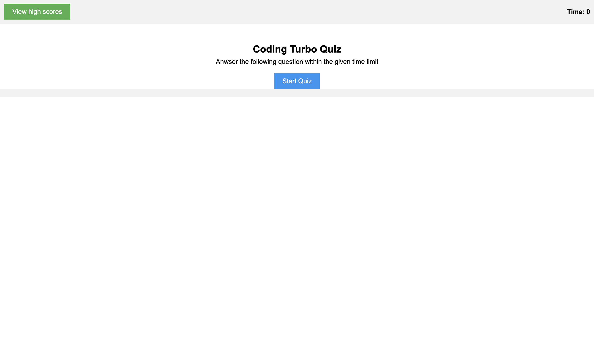

# Turbotechquiz

## Description
The motivation for this web application is to be able to take a timed quiz on some coding knowlege thats timed, and to get the highest time on the score board.
Inspect to look at code!
Github Portfile: https://github.com/JR728/turbotechquiz

## Installation
N/A

## Usage
The website https://jr728.github.io/turbotechquiz/ press start quiz to start the quiz and answer the questions correctly as fast as possible and type your initails when you finish the quiz to see the score board it will show at the end of the quiz or when you press view highscores when on main page

## Images

## Credit
Questions are from Walter Perry (TA)

## License
MIT